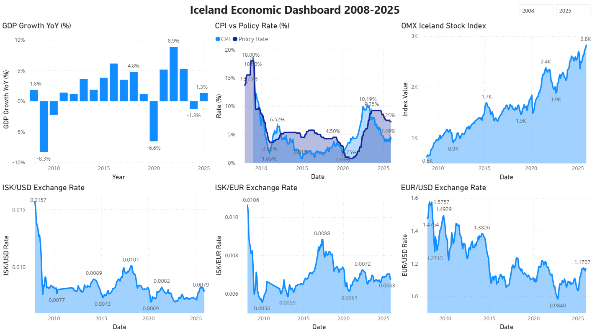
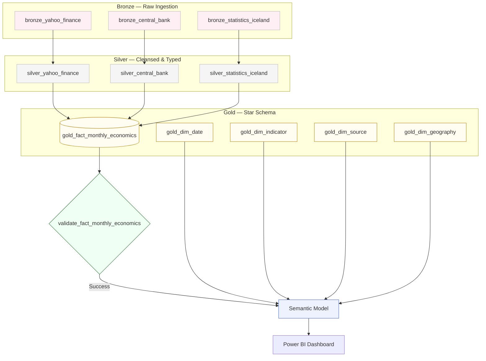

# Iceland Economic Analytics

An end-to-end Medallion data pipeline on **Microsoft Fabric** — ingesting Icelandic economic data from three public APIs, transforming it through Bronze → Silver → Gold layers, and delivering a Power BI dashboard covering 17 years of economic data (2008–2025).

Portfolio project for the **Microsoft Certified: Fabric Data Engineer Associate (DP-700)** certification.

---

## Dashboard

<div align="center">



</div>

---

## Background

Iceland is a small, open economy where changes in monetary policy, inflation, exchange rates, and GDP are closely connected and easy to observe. This project tracks 17 years of economic data across three key periods: the **2008 Financial Crisis**, the **2020 Pandemic**, and the **2023–2025 inflation cycle**.

| Source | Data | Frequency |
|---|---|---|
| [Yahoo Finance](https://finance.yahoo.com) via `yfinance` | ISK/USD, EUR/USD exchange rates, OMX Iceland All-Share Index | Daily |
| [Seðlabanki Íslands](https://sedlabanki.is) — XML API | Policy interest rate, CPI inflation | Daily / Monthly |
| [Hagstofa Íslands](https://hagstofa.is) — PX-Web REST API | Quarterly GDP year-on-year growth | Quarterly |

---

## Architecture

Data flows through the Medallion architecture with an industry-standard **Quality Gate** powered by **Great Expectations (GX)** before triggering a Semantic Model refresh.

<div align="center">



</div>

| Layer | Purpose |
|---|---|
| **Bronze** | Raw API ingestion. Data is persisted as-is with no transformations. |
| **Silver** | Cleaned, typed, and refined Delta tables. Includes outlier filtering and quarterly-to-monthly alignment. |
| **Gold** | Kimball Star Schema — one fact table and four independent dimension tables. |
| **Quality** | Great Expectations validation gate. The Semantic Model refresh is only triggered on success. |
| **Semantic Model** | Direct Lake connectivity over Gold Delta tables. DAX measures transform raw stored values into business KPIs (e.g. CPI year-on-year inflation rate). |
| **Dashboard** | Power BI report visualizing monetary policy, inflation, exchange rates, and GDP across the full 2008–2025 period. |

---

## Pipeline Orchestration

A master Data Factory pipeline orchestrates the full end-to-end flow. The Gold Fact Pipeline implements a **Gatekeeper pattern**: the Semantic Model refresh only executes if `validate_fact_monthly_economics` returns a success status, ensuring downstream consumers never see unvalidated data.

<div align="center">

### Master Pipeline


### Bronze Pipeline


### Silver Pipeline


### Gold Dimension Pipeline


### Gold Fact Pipeline


*30-second wait activities are included between notebook executions to respect Microsoft Fabric Trial capacity limits.*

</div>

---

## Notebooks

```
notebooks/
├── bronze/
│   ├── bronze_setup.ipynb                     # Initialize Lakehouse schema and folder structure
│   ├── bronze_yahoo_finance.ipynb             # Ingest ISK/USD, EUR/USD rates and OMX Iceland index → Bronze
│   ├── bronze_central_bank.ipynb              # Ingest policy interest rate and CPI series → Bronze
│   └── bronze_statistics_iceland.ipynb        # Ingest quarterly GDP growth via PX-Web API → Bronze
├── silver/
│   ├── silver_yahoo_finance.ipynb             # Clean exchange rates, filter outliers, derive ISK/EUR cross rate
│   ├── silver_central_bank.ipynb              # Parse and normalize policy rate and CPI series
│   └── silver_statistics_iceland.ipynb        # Align quarterly GDP observations to monthly date spine
├── gold/
│   ├── gold_fact_monthly_economics.ipynb      # UNION ALL Silver sources into unified fact table (MERGE)
│   ├── gold_dim_date.ipynb                    # Date dimension with full calendar attributes (1990–2030)
│   ├── gold_dim_indicator.ipynb               # Indicator metadata — codes, categories, units (SCD Type 0)
│   ├── gold_dim_source.ipynb                  # Source metadata — API details and update frequency (SCD Type 0)
│   └── gold_dim_geography.ipynb               # Geography dimension — country, region, currency
└── quality/
    └── validate_fact_monthly_economics.ipynb  # Great Expectations validation — blocks Semantic Model refresh on failure
```

---

## Gold Layer — Star Schema

The Gold layer implements a **Kimball Star Schema** optimized for **Direct Lake** connectivity in Power BI. Business metrics are decoupled from their descriptive attributes across four independent dimension tables, enabling high-performance queries without Import-mode data copies.

<div align="center">


</div>

---

## Semantic Model — DAX Measures

The Semantic Model sits on top of the Gold layer via **Direct Lake** mode, querying Delta files in OneLake directly. The most significant transformation occurs here: raw CPI index points (stored as absolute levels) are converted into a true **year-on-year inflation rate** using time intelligence.

```dax
CPI Inflation (YoY) =
VAR _currentIndex =
    CALCULATE(
        AVERAGE('fact_monthly_economics'[value]),
        'dim_indicator'[indicator_code] = "cpi"
    )
VAR _lastYearIndex =
    CALCULATE(
        AVERAGE('fact_monthly_economics'[value]),
        'dim_indicator'[indicator_code] = "cpi",
        SAMEPERIODLASTYEAR('dim_date'[full_date])
    )
RETURN
    DIVIDE(_currentIndex - _lastYearIndex, _lastYearIndex)
```

This pattern is applied consistently across all indicators that require period-over-period comparison, keeping the Gold layer storage-optimised and the business logic centralised in the model.

---

## Architecture Decisions

| Decision | Rationale |
|---|---|
| **Direct Lake Connectivity** | Queries Delta files in OneLake directly, providing Import-mode performance with DirectQuery-mode freshness — no data copy required. |
| **Decoupled Quality Layer** | Validation logic is isolated in `/quality/`, keeping business transformation (Gold) and data integrity (GX) concerns separate for independent auditing. |
| **Idempotent Loads (`MERGE INTO`)** | All Silver and Gold notebooks use `MERGE INTO` rather than overwrite, making every pipeline run safe to re-execute without producing duplicates. |
| **Gatekeeper Pattern** | The Semantic Model refresh is conditional on a GX success status. Failures halt the pipeline before unverified data can reach the dashboard. |
| **Wide Date Spine** | `dim_date` spans 1990–2030, wider than the dashboard's 2008–2025 view. This supports future data backfill and allows the Power BI date filter to be adjusted without a pipeline change. |

---

## Tech Stack

| Category | Technology |
|---|---|
| **Data Platform** | Microsoft Fabric — Lakehouse (OneLake / Delta), Data Factory, Power BI |
| **Processing** | PySpark, Spark SQL |
| **Data Quality** | Great Expectations 1.17.0 |
| **Ingestion** | `yfinance`, `requests`, `pandas` |

---

## How to Run

**Prerequisites:** A Microsoft Fabric workspace with F2+ capacity or an active Trial capacity.

1. **Initialize** — Run `notebooks/bronze/bronze_setup.ipynb` to create the Lakehouse and folder structure.
2. **Import Pipelines** — Import the Data Factory JSON files into your Fabric Workspace.
3. **Validate** — Confirm `quality/validate_fact_monthly_economics.ipynb` references your Gold tables.
4. **Execute** — Trigger the **Master Pipeline** to run the full end-to-end flow.
