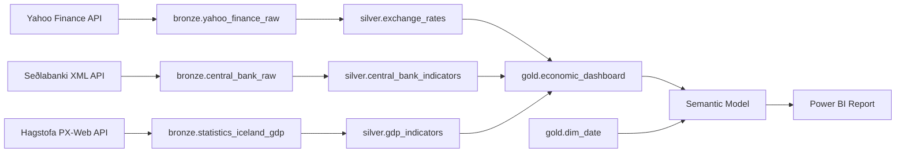

# Iceland Economic Analytics

A Medallion data pipeline on **Microsoft Fabric** that pulls real Icelandic economic data from three public APIs, transforms it through Bronze → Silver → Gold layers, and serves it as a Power BI dashboard.

Built as a portfolio project for the **Microsoft Certified: Fabric Data Engineer Associate** (DP-700) certification.

---

## Dashboard

<div align="center">


</div>

---

## Background

Iceland went through a full economic cycle between 2022 and 2026 — a post-pandemic tourism boom, contraction in 2024, and an aggressive Central Bank rate response. It is a small, open economy where the signals between monetary policy, inflation, exchange rates, and GDP are unusually direct and visible.

Three public data sources are combined to tell that story:

- **Yahoo Finance** — how currency markets and the stock index responded in real time
- **Seðlabanki Íslands** (Central Bank) — rate decisions and inflation month by month
- **Hagstofa Íslands** (Statistics Iceland) — official quarterly GDP growth figures

---

## How It Works

Data flows through three layers stored as Delta tables in a Microsoft Fabric Lakehouse:



| Layer | Purpose |
|---|---|
| **Bronze** | Raw data ingested as-is from each API |
| **Silver** | Cleaned, typed, and enriched — one table per source |
| **Gold** | `economic_dashboard` — monthly fact table for reporting. `dim_date` — daily date dimension for time intelligence |

---

## Pipeline Orchestration

A master Data Factory pipeline runs Bronze → Silver → Gold in sequence. Within each pipeline, 30-second wait activities are placed between notebook executions to handle Microsoft Fabric Trial capacity limits. This is a Trial capacity workaround and would be removed on a production F2+ capacity.

<div align="center">

**Master Pipeline**


**Bronze Pipeline**


**Silver Pipeline**


**Gold Pipeline**


</div>

---

## Data Sources

| Source | Data | Frequency |
|---|---|---|
| [Yahoo Finance](https://finance.yahoo.com) via `yfinance` | ISK/USD, EUR/USD exchange rates, OMX Iceland All-Share Index | Daily |
| [Seðlabanki Íslands](https://sedlabanki.is) — XML API | Policy interest rate, CPI inflation | Daily / Monthly |
| [Hagstofa Íslands](https://hagstofa.is) — PX-Web REST API | Quarterly GDP year-on-year growth | Quarterly |

---

## Notebooks

```
notebooks/
├── bronze/
│   ├── bronze_setup.ipynb            # Creates Bronze, Silver, and Gold schemas
│   ├── bronze_yahoo_finance.ipynb    # yfinance API → bronze.yahoo_finance_raw
│   ├── bronze_central_bank.ipynb     # Seðlabanki XML API → bronze.central_bank_raw
│   └── bronze_statistics.ipynb       # Hagstofa REST API → bronze.statistics_iceland_gdp
├── silver/
│   ├── silver_yahoo_finance.ipynb    # Clean + derive ISK/EUR → silver.exchange_rates
│   ├── silver_central_bank.ipynb     # Extract policy rate + CPI → silver.central_bank_indicators
│   └── silver_statistics.ipynb       # Add quarter date → silver.gdp_indicators
└── gold/
    ├── gold_economic_dashboard.ipynb # Monthly join of all Silver tables → gold.economic_dashboard
    └── gold_dim_date.ipynb           # Generates daily date spine → gold.dim_date
```

---

## Gold Table Schema

`gold.economic_dashboard` — one row per calendar month, consumed by Power BI

| Column | Type | Description |
|---|---|---|
| `date` | date | First day of the month |
| `year` | int | Year |
| `month` | int | Month number |
| `avg_iskusd` | double | Monthly avg ISK/USD exchange rate |
| `avg_iskeur` | double | Monthly avg ISK/EUR exchange rate |
| `avg_eurusd` | double | Monthly avg EUR/USD exchange rate |
| `avg_omx` | double | Monthly avg OMX Iceland All-Share Index |
| `policy_rate` | double | End-of-month Central Bank policy rate (%) |
| `cpi` | double | CPI year-on-year inflation (%) |
| `gdp_yoy_growth` | double | Quarterly GDP YoY growth (%) |
| `refreshed_at` | timestamp | When this row was last written by the pipeline |

---

## Design Decisions

**Incremental Bronze load** — All three Bronze notebooks load incrementally. Yahoo Finance and Central Bank read the `MAX(date)` watermark from the existing table and fetch only new dates, then append. Statistics Iceland fetches the full dataset from the API on every run (the PX-Web API has no date filter parameter), but filters to new quarters before appending. On first run each notebook falls back to a full load from `2022-01-01`.

**MERGE over overwrite** — All Silver and Gold notebooks use MERGE INTO instead of overwrite. This makes every pipeline run idempotent and safe to retry without duplicating or losing data.

**SQL for transformations** — All transformation logic in Silver and Gold is written in Spark SQL. Python handles orchestration, control flow, and writes. This keeps the separation of concerns clean and makes the logic easier to read and audit.

**Validation at Bronze** — Data quality checks sit at the API boundary in Bronze, before data enters the Lakehouse. By the time data reaches Silver it has already been validated, so Silver and Gold stay focused on transformation.

**dim_date in Gold** — A dedicated date dimension table enables proper time intelligence in the Semantic Model without relying on Power BI's auto date/time feature, which is disabled in enterprise environments.

---

## Tech Stack

**Microsoft Fabric**
- **Lakehouse** — Central storage with Bronze, Silver, and Gold schemas on OneLake
- **Notebooks** — PySpark notebooks for data ingestion and transformation at each layer
- **Data Factory Pipelines** — Orchestrates notebook execution across Bronze → Silver → Gold
- **Semantic Model** — Built on top of `gold.economic_dashboard` and `gold.dim_date` using Direct Lake mode, which reads Delta files directly from OneLake without importing data. The `dim_date` table enables time intelligence via an explicit date relationship rather than Power BI's auto date/time feature.
- **Power BI Report** — Interactive dashboard with auto-refresh via the Fabric Semantic Model

**Languages & Libraries**
- **PySpark** — Data transformation across all pipeline layers
- **Delta Lake** — ACID-compliant storage with schema enforcement
- **Python** — `yfinance`, `requests`, `xml.etree.ElementTree`, `pandas`
