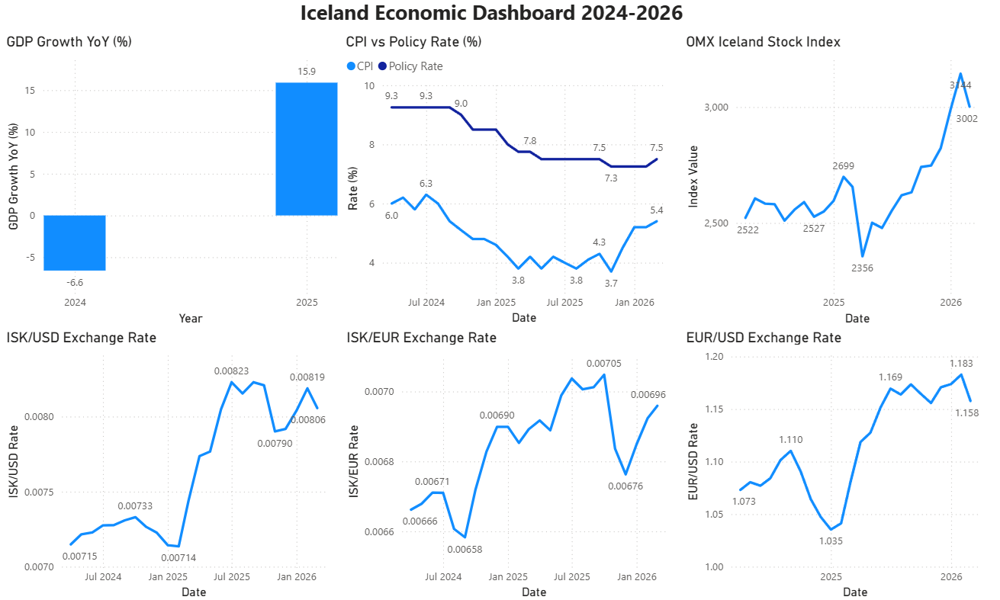

# Iceland Economic Analytics

A Medallion data pipeline on **Microsoft Fabric** that pulls real Icelandic economic data from three public APIs, transforms it through Bronze → Silver → Gold layers, and serves it as a Power BI dashboard.

Built as a DP-700 (Microsoft Fabric Analytics Engineer) portfolio project.

---

## Dashboard

<div align="center">



</div>

---

## Background

Iceland went through a full economic cycle between 2022 and 2025 — a post-pandemic tourism boom, contraction in 2024, and an aggressive Central Bank rate response. It is a small, open economy where the signals between monetary policy, inflation, exchange rates, and GDP are unusually direct and visible.

Three public data sources are combined to tell that story:

- **Yahoo Finance** — how currency markets and the stock index responded in real time
- **Seðlabanki Íslands** (Central Bank) — rate decisions and inflation month by month
- **Hagstofa Íslands** (Statistics Iceland) — official quarterly GDP growth figures

---

## How It Works

Data flows through three layers stored as Delta tables in a Microsoft Fabric Lakehouse:

```
Bronze (raw)               Silver (cleaned)                  Gold (aggregated)
──────────────────         ────────────────────────          ──────────────────────
yahoo_finance_raw    →     exchange_rates              →
central_bank_raw     →     central_bank_indicators     →     economic_dashboard
statistics_gdp       →     gdp_indicators              →
```

| Layer | Purpose |
|---|---|
| **Bronze** | Raw data ingested as-is from each API |
| **Silver** | Cleaned, typed, and enriched — one table per source |
| **Gold** | Single monthly table joining all three sources for reporting |

---

## Pipeline Orchestration

A master Data Factory pipeline runs Bronze → Silver → Gold in sequence. Within each pipeline, 30-second wait activities are placed between notebook executions to handle Microsoft Fabric Trial capacity limits.

<div align="center">

**Master Pipeline**


**Bronze Pipeline**


**Silver Pipeline**


**Gold Pipeline**


</div>

---

## Data Sources

| Source | Data | Frequency |
|---|---|---|
| [Yahoo Finance](https://finance.yahoo.com) via `yfinance` | ISK/USD, EUR/USD exchange rates, OMX Iceland All-Share Index | Daily |
| [Seðlabanki Íslands](https://sedlabanki.is) — XML API | Policy interest rate, CPI inflation | Daily / Monthly |
| [Hagstofa Íslands](https://hagstofa.is) — PX-Web REST API | Quarterly GDP year-on-year growth | Quarterly |

---

## Notebooks

```
notebooks/
├── bronze/
│   ├── bronze_yahoo_finance.ipynb    # yfinance API → bronze.yahoo_finance_raw
│   ├── bronze_central_bank.ipynb     # Seðlabanki XML API → bronze.central_bank_raw
│   └── bronze_statistics.ipynb       # Hagstofa REST API → bronze.statistics_iceland_gdp
├── silver/
│   ├── silver_yahoo_finance.ipynb    # Clean + derive ISK/EUR → silver.exchange_rates
│   ├── silver_central_bank.ipynb     # Extract policy rate + CPI → silver.central_bank_indicators
│   └── silver_statistics.ipynb       # Add quarter date → silver.gdp_indicators
└── gold/
    └── gold_economic_dashboard.ipynb # Monthly join of all Silver tables → gold.economic_dashboard
```

---

## Gold Table Schema

`gold.economic_dashboard` — one row per calendar month, consumed by Power BI

| Column | Type | Description |
|---|---|---|
| `date` | date | First day of the month |
| `year` | int | Year |
| `month` | int | Month number |
| `avg_iskusd` | double | Monthly avg ISK/USD exchange rate |
| `avg_iskeur` | double | Monthly avg ISK/EUR exchange rate |
| `avg_eurusd` | double | Monthly avg EUR/USD exchange rate |
| `avg_omx` | double | Monthly avg OMX Iceland All-Share Index |
| `policy_rate` | double | End-of-month Central Bank policy rate (%) |
| `cpi` | double | CPI year-on-year inflation (%) |
| `gdp_yoy_growth` | double | Quarterly GDP YoY growth (%) |

---

## Tech Stack

**Microsoft Fabric**
- **Lakehouse** — Central storage with Bronze, Silver, and Gold schemas on OneLake
- **Notebooks** — PySpark notebooks for data ingestion and transformation at each layer
- **Data Factory Pipelines** — Orchestrates notebook execution across Bronze → Silver → Gold
- **Semantic Model** — Built on top of the Gold table with a date column for time intelligence in Power BI
- **Power BI Report** — Interactive dashboard with auto-refresh via the Fabric Semantic Model

**Languages & Libraries**
- **PySpark** — Data transformation across all pipeline layers
- **Delta Lake** — ACID-compliant storage with schema enforcement
- **Python** — `yfinance`, `requests`, `xml.etree.ElementTree`, `pandas`
