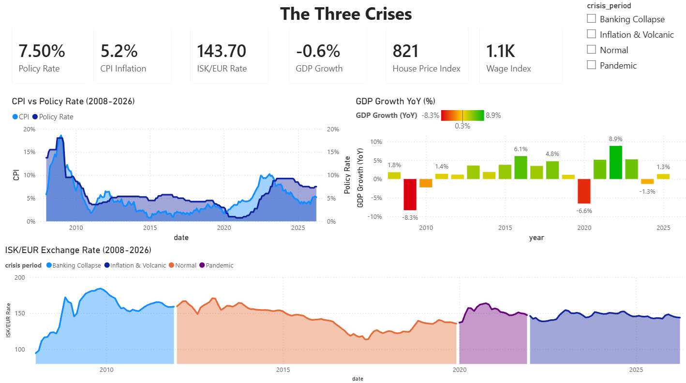
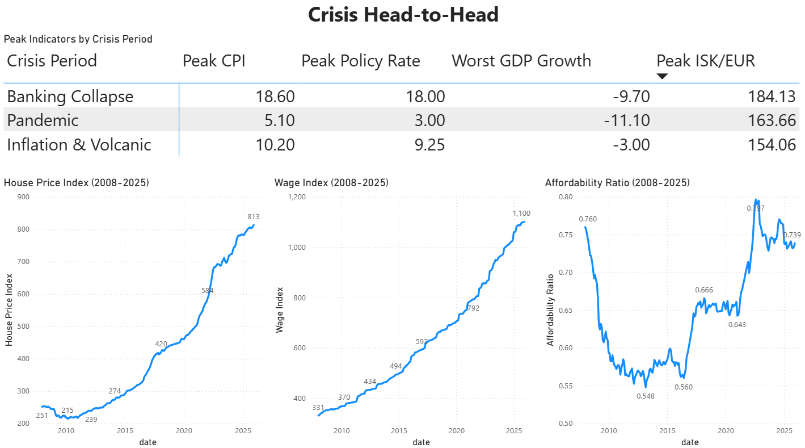
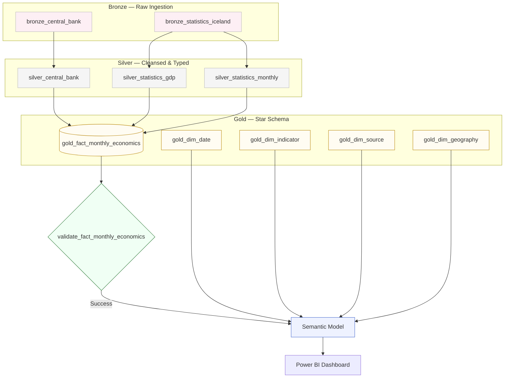
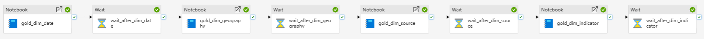
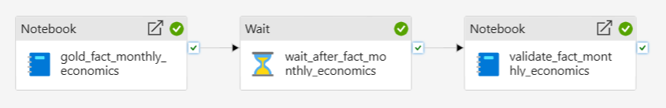
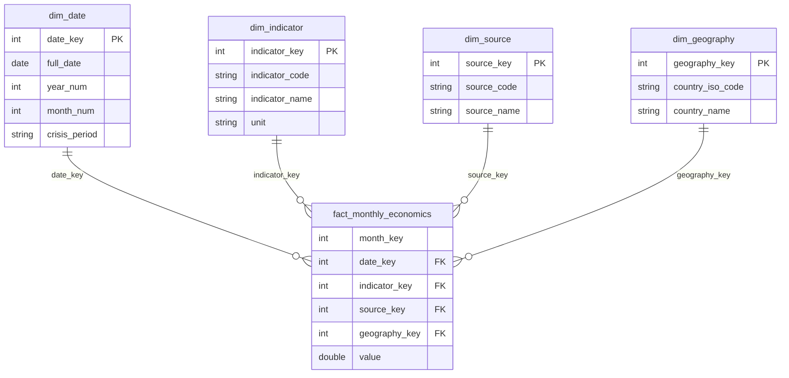
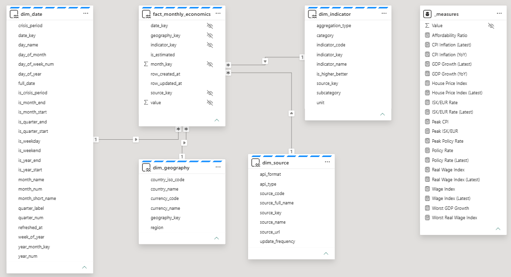

# Iceland Economic Analytics

An end-to-end Microsoft Fabric data engineering pipeline tracking Iceland's economic performance across three major crises: the 2008 banking collapse, the 2020 pandemic, and the 2022–2024 inflation and volcanic period.

Built as a portfolio project for the **Microsoft Certified: Fabric Data Engineer Associate (DP-700)** certification.

---

## Overview

Iceland has faced three major economic crises in 16 years:

*   **2008** — The entire banking system collapsed overnight.
*   **2020** — Tourism vanished and GDP cratered.
*   **2022–2024** — Inflation hit 10%, interest rates reached 9.25%, and volcanic eruptions displaced thousands.

Official data from **Seðlabanki Íslands** (Central Bank of Iceland) and **Hagstofa Íslands** (Statistics Iceland) is ingested into Microsoft Fabric and transformed through a Bronze → Silver → Gold medallion pipeline into a Kimball star schema, served by a Power BI Direct Lake semantic model.

---

## Dashboard

<div align="center">

### Page 1 — The Three Crises
*CPI vs Policy Rate, GDP Growth, ISK/EUR — full timeline 2008–2025 with crisis period filter*



### Page 2 — Crisis Head-to-Head
*Peak indicators compared across Banking Collapse, Pandemic, and Inflation & Volcanic periods*



</div>

---

## Data Sources

| Source | Data | Frequency |
|---|---|---|
| [Seðlabanki Íslands](https://sedlabanki.is) — XML API | Policy rate, CPI inflation, ISK/EUR exchange rate | Daily / Monthly |
| [Hagstofa Íslands](https://hagstofa.is) — PX-Web REST API | GDP YoY growth (quarterly), House Price Index, Wage Index | Monthly / Quarterly |

All data is sourced directly from official Icelandic institutions.

---

## Architecture

Data flows through a Medallion architecture with a **Great Expectations quality gate** before triggering a Semantic Model refresh.

<div align="center">



</div>

| Layer | Purpose |
|---|---|
| **Bronze** | Raw API ingestion. Data is persisted as-is with no transformations. |
| **Silver** | Cleaned, typed, and deduplicated Delta tables. Includes date parsing and metric mapping. |
| **Gold** | Kimball Star Schema — one fact table and four dimension tables. |
| **Quality** | Great Expectations validation gate. Semantic Model refresh only triggers on success. |
| **Semantic Model** | Direct Lake connectivity over Gold Delta tables. |
| **Dashboard** | Power BI report visualizing all six indicators across the three crisis periods. |

---

## Pipeline Orchestration

A master Data Factory pipeline orchestrates the full end-to-end flow. The Gold Fact Pipeline implements a **Gatekeeper pattern**: the Semantic Model refresh only executes if `validate_fact_monthly_economics` returns a success status.

<div align="center">

### Master Pipeline


### Bronze Pipeline


### Silver Pipeline


### Gold Dimension Pipeline


### Gold Fact Pipeline


*30-second wait activities are included between notebook executions to respect Microsoft Fabric Trial capacity limits.*

</div>

## Project Structure

```text
├── notebooks/                   # PySpark & Spark SQL Transformation Logic
│   ├── bronze/                  # API Ingestion
│   ├── silver/                  # Cleaning & Normalization
│   ├── gold/                    # Star Schema Dimensional Modeling
│   └── quality/                 # Great Expectations Validation
├── pipelines/                   # Data Factory Pipeline Definitions (JSON)
│   ├── master_pipeline.json     # Full end-to-end orchestration
│   ├── bronze_pipeline.json
│   ├── silver_pipeline.json
│   ├── gold_dim_pipeline.json
│   └── gold_fact_pipeline.json
├── semantic_model/              # Power BI Direct Lake Model
│   └── measures.dax             # Calculated measures logic
└── assets/                      # Dashboard screenshots & Diagrams
```

---

## Notebooks

```
notebooks/
├── bronze/
│   ├── bronze_setup.ipynb                    # Initialize Lakehouse schema and folder structure
│   ├── bronze_central_bank.ipynb             # Ingest policy rate, CPI, ISK/EUR (GroupID 1, 3, 9)
│   └── bronze_statistics_iceland.ipynb       # Ingest GDP, HPI, Wage Index via PX-Web API
├── silver/
│   ├── silver_central_bank.ipynb             # Parse and normalize policy_rate, cpi, iskeur
│   ├── silver_statistics_gdp.ipynb           # Parse quarterly GDP, assign to quarter-start month
│   └── silver_statistics_monthly.ipynb       # Parse monthly HPI and Wage Index period strings
├── gold/
│   ├── gold_fact_monthly_economics.ipynb     # UNION ALL Silver sources into narrow fact table (MERGE)
│   ├── gold_dim_date.ipynb                   # Date dimension with crisis_period labels (1990–2030)
│   ├── gold_dim_indicator.ipynb              # Indicator metadata — codes, categories, units (SCD Type 0)
│   ├── gold_dim_source.ipynb                 # Source metadata — API details and update frequency (SCD Type 0)
│   └── gold_dim_geography.ipynb              # Geography dimension — country, region, currency
└── quality/
    └── validate_fact_monthly_economics.ipynb # Great Expectations validation — blocks refresh on failure
```

---

## Gold Layer — Star Schema



### `gold.fact_monthly_economics`

| Column | Type | Description |
|---|---|---|
| `date_key` | int | FK to dim_date (YYYYMMDD) |
| `month_key` | int | YYYYMM |
| `indicator_key` | int | FK to dim_indicator |
| `source_key` | int | FK to dim_source |
| `geography_key` | int | FK to dim_geography |
| `value` | double | Indicator value |
| `is_estimated` | bool | Estimation flag |

### `gold.dim_indicator`

| indicator_code | Description | Unit | Source |
|---|---|---|---|
| `policy_rate` | Central Bank Policy Rate | Percent (%) | Seðlabanki |
| `cpi` | CPI Year-on-Year Inflation | Percent (%) | Seðlabanki |
| `iskeur` | ISK/EUR Exchange Rate | ISK per 1 EUR | Seðlabanki |
| `gdp_yoy_growth` | GDP Year-on-Year Growth | Percent (%) | Hagstofa |
| `hpi` | House Price Index | Index (Mar 2000=100) | Hagstofa |
| `wage_index` | Wage Index | Index (Dec 2018=100) | Hagstofa |

### `gold.dim_date`

Standard daily date spine (1990–2030) with full calendar attributes.

`crisis_period` labels each date as `Banking Collapse` (2008–2011), `Pandemic` (2020–2021), `Inflation & Volcanic` (2022–2024), or `Normal`. `is_crisis_period` boolean flag. Used in Power BI for shaded crisis bands without DAX complexity.

---

## Semantic Model (Direct Lake)

The project utilizes a **Direct Lake** semantic model for high-performance analytics, loading Delta Parquet files directly from OneLake into memory.

<div align="center">



</div>

The DAX measures used in the dashboard can be found in `semantic_model/measures.dax`.

---

## Architecture Decisions

| Decision | Rationale |
|---|---|
| **Official sources only** | All data from Seðlabanki and Hagstofa. No third-party dependencies that could silently break. |
| **Direct Lake Connectivity** | Import-mode performance with DirectQuery-mode freshness — no data copy required. |
| **Idempotent loads (`MERGE INTO`)** | Every Silver and Gold notebook is safe to re-run without duplicating data. |
| **UNION ALL in gold fact** | One CTE per metric, joined to dim_indicator by code. Adding a new indicator is one extra `UNION ALL` block. |
| **GDP at quarter-start month** | Quarterly values map to the first month of their quarter (Q1→Jan). Accurate grain — no value duplication across 3 months. |
| **HPI + Wages in one silver table** | Both are monthly, share identical schema, and come from the same bronze table. Single notebook, single Delta table. |
| **Decoupled quality layer** | Validation logic isolated in `/quality/`, keeping Gold transformation and GX concerns separate. |
| **Gatekeeper pattern** | Semantic Model refresh is conditional on GX success. Failures halt before unverified data reaches the dashboard. |
| **Crisis period in dim_date** | `crisis_period` and `is_crisis_period` columns enable Power BI shaded bands with no DAX required. |
| **Wide date spine** | `dim_date` spans 1990–2030, supporting future backfill without a schema change. |

---

## Tech Stack

| Category | Technology |
|---|---|
| **Data Platform** | Microsoft Fabric — Lakehouse (OneLake / Delta), Data Factory, Power BI |
| **Processing** | PySpark, Spark SQL |
| **Data Quality** | Great Expectations 1.17.0 |
| **Ingestion** | `requests`, `pandas`, `xml.etree.ElementTree` |

---

## How to Run

**Prerequisites:** A Microsoft Fabric workspace with F2+ capacity or an active Trial capacity.

1. **Initialize** — Run `notebooks/bronze/bronze_setup.ipynb` to create the Lakehouse schema and folder structure.
2. **Import Pipelines** — Use the JSON definitions in the `/pipelines` folder to recreate the Data Factory flow, or reference them to manually configure your activities.
3. **Validate** — Confirm `quality/validate_fact_monthly_economics.ipynb` correctly references your Gold tables.
4. **Execute** — Trigger the **Master Pipeline** to run the full end-to-end flow.

### Pipeline Run Order

1. `bronze_setup`
2. `bronze_central_bank`
3. `bronze_statistics_iceland`
4. `silver_central_bank`
5. `silver_statistics_gdp`
6. `silver_statistics_monthly`
7. `gold_dim_date`
8. `gold_dim_indicator`
9. `gold_dim_source`
10. `gold_dim_geography`
11. `gold_fact_monthly_economics`
12. `validate_fact_monthly_economics`