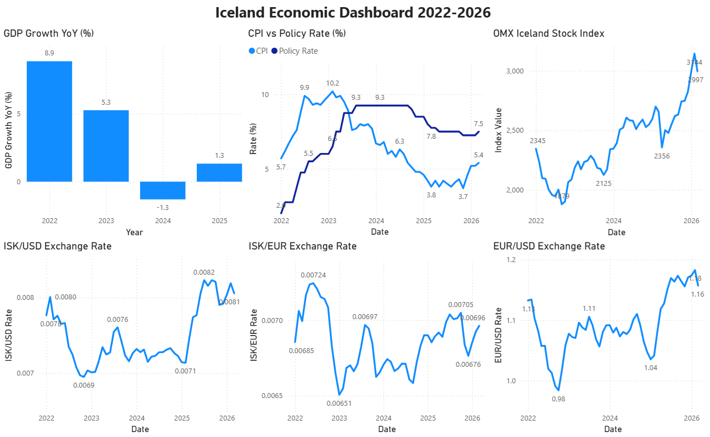
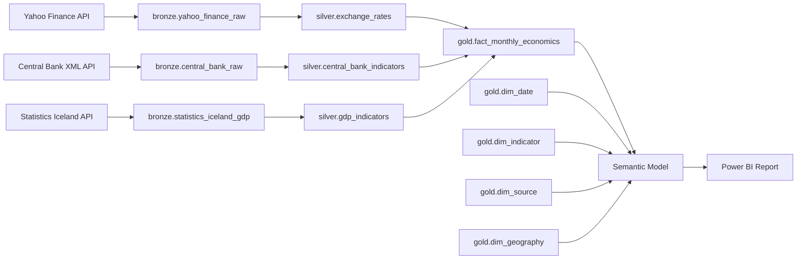
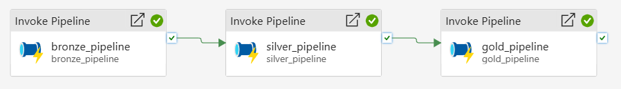
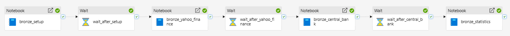
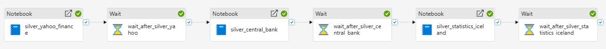
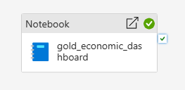

# Iceland Economic Analytics

A Medallion data pipeline on **Microsoft Fabric** that pulls real Icelandic economic data from three public APIs, transforms it through Bronze → Silver → Gold layers, and serves it as a Power BI dashboard.

Built as a portfolio project for the **Microsoft Certified: Fabric Data Engineer Associate** (DP-700) certification.

---

## Dashboard

<div align="center">



</div>

---

## Background

Iceland went through a full economic cycle between 2022 and 2026 — a post-pandemic tourism boom, contraction in 2024, and an aggressive Central Bank rate response. It is a small, open economy where the signals between monetary policy, inflation, exchange rates, and GDP are unusually direct and visible.

Three public data sources are combined to tell that story:

- **Yahoo Finance** — how currency markets and the stock index responded in real time
- **Seðlabanki Íslands** (Central Bank) — rate decisions and inflation month by month
- **Hagstofa Íslands** (Statistics Iceland) — official quarterly GDP growth figures

---

## How It Works

Data flows through three layers stored as Delta tables in a Microsoft Fabric Lakehouse:



| Layer | Purpose |
|---|---|
| **Bronze** | Raw data ingested as-is from each API |
| **Silver** | Cleaned, typed, and enriched — one table per source |
| **Gold** | Kimball star schema — `fact_monthly_economics` (periodic snapshot), `dim_date`, `dim_indicator`, `dim_source`, `dim_geography` |

---

## Pipeline Orchestration

A master Data Factory pipeline runs Bronze → Silver → Gold in sequence. Within each pipeline, 30-second wait activities are placed between notebook executions to handle Microsoft Fabric Trial capacity limits. This is a Trial capacity workaround and would be removed on a production F2+ capacity.

<div align="center">

**Master Pipeline**



**Bronze Pipeline**



**Silver Pipeline**



**Gold Pipeline**



</div>

---

## Data Sources

| Source | Data | Frequency |
|---|---|---|
| [Yahoo Finance](https://finance.yahoo.com) via `yfinance` | ISK/USD, EUR/USD exchange rates, OMX Iceland All-Share Index | Daily |
| [Seðlabanki Íslands](https://sedlabanki.is) — XML API | Policy interest rate, CPI inflation | Daily / Monthly |
| [Hagstofa Íslands](https://hagstofa.is) — PX-Web REST API | Quarterly GDP year-on-year growth | Quarterly |

---

## Notebooks

```
notebooks/
├── bronze/
│   ├── bronze_setup.ipynb            # Creates Bronze, Silver, and Gold schemas
│   ├── bronze_yahoo_finance.ipynb    # yfinance API → bronze.yahoo_finance_raw
│   ├── bronze_central_bank.ipynb     # Seðlabanki XML API → bronze.central_bank_raw
│   └── bronze_statistics.ipynb       # Hagstofa REST API → bronze.statistics_iceland_gdp
├── silver/
│   ├── silver_yahoo_finance.ipynb    # Clean + derive ISK/EUR → silver.exchange_rates
│   ├── silver_central_bank.ipynb     # Extract policy rate + CPI → silver.central_bank_indicators
│   └── silver_statistics.ipynb       # Add quarter date → silver.gdp_indicators
└── gold/
    ├── gold_fact_monthly_economics.ipynb # Monthly join + UNION ALL unpivot → gold.fact_monthly_economics
    ├── gold_dim_date.ipynb           # Daily date spine (2022–2030) → gold.dim_date
    ├── gold_dim_indicator.ipynb      # Economic indicator metadata → gold.dim_indicator
    ├── gold_dim_source.ipynb         # Data source metadata → gold.dim_source
    └── gold_dim_geography.ipynb      # Geography dimension → gold.dim_geography
```

---

## Gold Layer — Kimball Star Schema

The Gold layer implements a dimensional model inspired by *The Data Warehouse Toolkit, 3rd Edition* (Kimball). The design follows the four-step process — business process, grain, dimensions, facts — and applies industry-standard conventions: integer surrogate keys, YYYYMMDD and YYYYMM key formats, SCD Type 0 for static dimensions, and conformed dimensions built for reuse across future fact tables.

```
                    ┌─────────────────┐
                    │   dim_date      │
                    │  (date_key PK)  │
                    └────────┬────────┘
                             │ date_key FK
┌──────────────┐             │             ┌──────────────────┐
│ dim_source   │  source_key FK            │  dim_indicator   │
│ (source_key) ├─────────────┼─────────────┤  (indicator_key) │
└──────────────┘             │             └──────────────────┘
                    ┌────────▼────────┐
                    │fact_monthly_    │
                    │economics        │
                    │(month_key,      │
                    │ indicator_key)  │
                    └────────┬────────┘
                             │ geography_key FK
                    ┌────────▼────────┐
                    │  dim_geography  │
                    │ (geography_key) │
                    └─────────────────┘
```

### `gold.fact_monthly_economics` — periodic snapshot fact table

Grain: one row per calendar month per economic indicator.  
Composite key: `(month_key, indicator_key)`

| Column | Type | Description |
|---|---|---|
| `month_key` | int | Grain surrogate — YYYYMM (e.g. 202401) |
| `date_key` | int | FK → `gold.dim_date` — YYYYMMDD of first day of month |
| `indicator_key` | int | FK → `gold.dim_indicator` |
| `source_key` | int | FK → `gold.dim_source` — denormalised from dim_indicator |
| `geography_key` | int | FK → `gold.dim_geography` — 1 (Iceland) for all rows |
| `value` | double | Indicator value for the month |
| `is_estimated` | boolean | True if value is provisional or estimated |
| `row_created_at` | timestamp | When this row was first inserted into the warehouse |
| `row_updated_at` | timestamp | When this row was last updated by the pipeline |

### `gold.dim_date` — date dimension

Grain: one row per calendar day, 2022-01-01 to 2030-12-31.

| Column | Type | Description |
|---|---|---|
| `date_key` | int | Surrogate key — YYYYMMDD (e.g. 20240101) |
| `full_date` | date | Calendar date — natural key |
| `day_of_week_num` | int | 1 (Sunday) – 7 (Saturday) |
| `day_name` | string | Full day name (e.g. Monday) |
| `day_of_month` | int | Day number within the month (1–31) |
| `day_of_year` | int | Day number within the year (1–366) |
| `week_of_year` | int | ISO week number (1–53) |
| `month_num` | int | Month number (1–12) |
| `month_name` | string | Full month name (e.g. January) |
| `month_short_name` | string | Abbreviated month name (e.g. Jan) |
| `quarter_num` | int | Quarter number (1–4) |
| `quarter_label` | string | e.g. 2024 Q1 |
| `year_num` | int | Calendar year (e.g. 2024) |
| `year_month_key` | int | YYYYMM — joins to `fact_monthly_economics.month_key` |
| `is_weekday` | boolean | True if Monday–Friday |
| `is_weekend` | boolean | True if Saturday or Sunday |
| `is_month_start` | boolean | True if first day of the month |
| `is_month_end` | boolean | True if last day of the month |
| `is_quarter_start` | boolean | True if first day of January, April, July, or October |
| `is_quarter_end` | boolean | True if last day of March, June, September, or December |
| `is_year_start` | boolean | True if 1 January |
| `is_year_end` | boolean | True if 31 December |

### `gold.dim_indicator` — indicator dimension

Grain: one row per economic indicator (7 total). SCD Type 0.

| Column | Type | Description |
|---|---|---|
| `indicator_key` | int | Surrogate key |
| `indicator_code` | string | Natural key — column name in Silver source tables |
| `indicator_name` | string | Business-friendly display name |
| `category` | string | FX / Equities / Monetary Policy / Inflation / GDP |
| `subcategory` | string | Secondary classification |
| `unit` | string | Unit of measure (e.g. ISK per 1 USD, Percent) |
| `aggregation_type` | string | Average or End-of-period |
| `is_higher_better` | boolean | True if a higher value is favourable — for KPI formatting |
| `source_key` | int | FK → `gold.dim_source` |

### `gold.dim_source` — source dimension

Grain: one row per data source (3 total). SCD Type 0.

| Column | Type | Description |
|---|---|---|
| `source_key` | int | Surrogate key |
| `source_code` | string | Natural key — stable business identifier |
| `source_name` | string | Short display name |
| `source_full_name` | string | Official full name |
| `api_type` | string | REST or XML |
| `api_format` | string | JSON, XML, PX-Web JSON |
| `update_frequency` | string | How often the source publishes new data |
| `source_url` | string | Base URL of the data source |

### `gold.dim_geography` — geography dimension

Grain: one row per country (1 total — Iceland). SCD Type 0.  
Included per Kimball conventions for future extensibility.

| Column | Type | Description |
|---|---|---|
| `geography_key` | int | Surrogate key |
| `country_iso_code` | string | ISO 3166-1 alpha-2 country code |
| `country_name` | string | English country name |
| `region` | string | Geographic region |
| `currency_code` | string | ISO 4217 currency code |
| `currency_name` | string | Full currency name |

---

## Design Decisions

**Incremental Bronze load** — All three Bronze notebooks load incrementally. Yahoo Finance and Central Bank read the `MAX(date)` watermark from the existing table and fetch only new dates, then append. Statistics Iceland fetches the full dataset from the API on every run (the PX-Web API has no date filter parameter), but filters to new quarters before appending. On first run each notebook falls back to a full load from `2022-01-01`.

**Incremental Silver load** — The Yahoo Finance Silver notebook reads a `MAX(date)` watermark from `silver.exchange_rates` and passes it as a filter when reading Bronze, so only new rows are processed each run. Combined with the incremental Bronze load, the full pipeline processes only the delta on every execution.

**MERGE over overwrite** — All Silver and Gold notebooks use MERGE INTO instead of overwrite. This makes every pipeline run idempotent and safe to retry without duplicating or losing data.

**SQL for transformations** — All transformation logic in Silver and Gold is written in Spark SQL. Python handles orchestration, control flow, and writes. This keeps the separation of concerns clean and makes the logic easier to read and audit.

**Validation at Bronze** — Data quality checks sit at the API boundary in Bronze, before data enters the Lakehouse. By the time data reaches Silver it has already been validated, so Silver and Gold stay focused on transformation.

**Kimball dimensional modelling in Gold** — The Gold layer implements a star schema inspired by *The Data Warehouse Toolkit* (Kimball): a narrow periodic snapshot fact table (`fact_monthly_economics`) joined to four conformed dimensions (`dim_date`, `dim_indicator`, `dim_source`, `dim_geography`). Surrogate keys follow industry convention — `date_key` uses YYYYMMDD, `month_key` uses YYYYMM. The fact is unpivoted from wide Silver aggregates using `UNION ALL`, producing one row per month per indicator. All dimensions use SCD Type 0 — definitions and metadata are fixed and do not change over time. `dim_date` uses a YYYYMMDD integer surrogate key enabling proper time intelligence in the Semantic Model without relying on Power BI's auto date/time feature, which is disabled in enterprise environments.

---

## Tech Stack

**Microsoft Fabric**
- **Lakehouse** — Central storage with Bronze, Silver, and Gold schemas on OneLake
- **Notebooks** — PySpark notebooks for data ingestion and transformation at each layer
- **Data Factory Pipelines** — Orchestrates notebook execution across Bronze → Silver → Gold
- **Semantic Model** — Built on top of `gold.fact_monthly_economics`, `gold.dim_date`, `gold.dim_indicator`, `gold.dim_source`, and `gold.dim_geography` using Direct Lake mode, which reads Delta files directly from OneLake without importing data.
- **Power BI Report** — Interactive dashboard with auto-refresh via the Fabric Semantic Model

**Languages & Libraries**
- **PySpark** — Data transformation across all pipeline layers
- **Delta Lake** — ACID-compliant storage with schema enforcement
- **Python** — `yfinance`, `requests`, `xml.etree.ElementTree`, `pandas`
